# Membuat Program dan Flowchart dari program Tiket Bioskop dan juga Kalkulator
Tugas Pertemuan Ke 6

Nama: Ro'uf Muhammad Fauzan

Kelas: TI 24 A1

NIM: 312410157

# 1. Tiket Bioskop
Program tiket bioskop ini adalah program untuk menghitung harga Tiket bioskop. Konsepnya adalah jika user memiliki kartu member maka user akan mendapatkan diskon 20%
## Flowchart
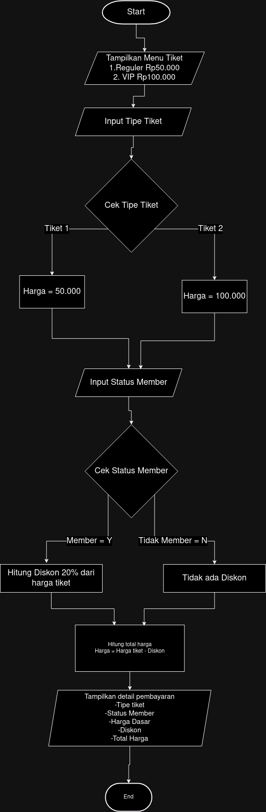
## code
````
# Program menghitung harga tiket bioskop
print("=== Program Hitung Harga Tiket Bioskop ===")
print("1. Reguler (Rp50.000)")
print("2. VIP (Rp100.000)")

# Input tipe tiket
tipe_tiket = input("Pilih tipe tiket (1/2): ")

# Input status member
status_member = input("Apakah anda memiliki kartu member? (y/n): ")

# Harga dasar tiket menggunakan operator ternary
harga_dasar = 50000 if tipe_tiket == "1" else 100000

# Hitung diskon menggunakan operator ternary
diskon = 0.2 if status_member.lower() == "y" else 0

# Hitung total harga
total_harga = harga_dasar - (harga_dasar * diskon)

# Output informasi
print("\n=== Detail Pembayaran ===")
print(f"Tipe Tiket: {'Reguler' if tipe_tiket == '1' else 'VIP'}")
print(f"Status Member: {'Ya' if status_member.lower() == 'y' else 'Tidak'}")
print(f"Harga Dasar: Rp{harga_dasar:,.0f}")
print(f"Diskon: {diskon*100:.0f}%")
print(f"Total Harga: Rp{total_harga:,.0f}")
````
## Penjelasan dari code program tiket bioskop

1.Perintah dibawah adalah untuk menampilkan judul program dan pilihan tiket yang tersedia.
````
print("=== Program Hitung Harga Tiket Bioskop ===")
print("1. Reguler (Rp50.000)")
print("2. VIP (Rp100.000)")
````
2.Input tipe tiket
````
tipe_tiket = input("Pilih tipe tiket (1/2): ")
````
Program akan meminta input tipe tiket dari user dan menyimpannya di variabel tipe_tiket

3.Input status member
````
status_member = input("Apakah anda memiliki kartu member? (y/n): ")
````
Program akan meminta input status member dari user.

4.Harga dasar tiket menggunakan operator ternary
````
harga_dasar = 50000 if tipe_tiket == "1" else 100000
````
Jika tipe_tiket="1" maka harga=50000 , jika tidak maka harga=100000
5.Hitung Diskon
````
diskon = 0.2 if status_member.lower() == "y" else 0
````
Jika status_member="y" maka diskon=0.2 (20%), jika tidak maka diskon=0

6.Menghitung total harga
````
total_harga = harga_dasar - (harga_dasar * diskon)
````
Menghitung total harga setelah diskon

7.Menampilkan output dari input yang dimasukkan user
````
print("\n=== Detail Pembayaran ===")
print(f"Tipe Tiket: {'Reguler' if tipe_tiket == '1' else 'VIP'}")
print(f"Status Member: {'Ya' if status_member.lower() == 'y' else 'Tidak'}")
print(f"Harga Dasar: Rp{harga_dasar:,.0f}")
print(f"Diskon: {diskon*100:.0f}%")
print(f"Total Harga: Rp{total_harga:,.0f}")
````
## output
#### Program akan meminta user untuk menginputkan tipe tiket
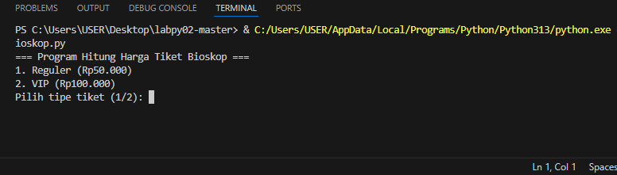
#### Program akan menanyakan status member
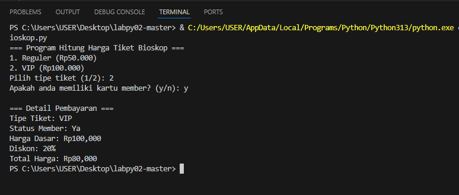
Jika user memiliki kartu member maka akan dapat diskon 20%
#### Output apabila input yang dimasukkan user adalah N atau tidak memiliki member
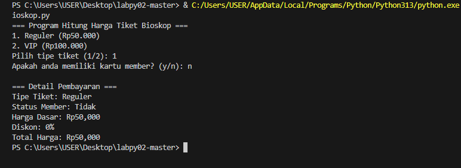

# 2. Kalkulator sederhana
Program ini adalah program Kalkulator sederhana yang berfungsi untuk menghitung dua angka sesuai dengan operasi hitung yang dipilih.
## Flowchart
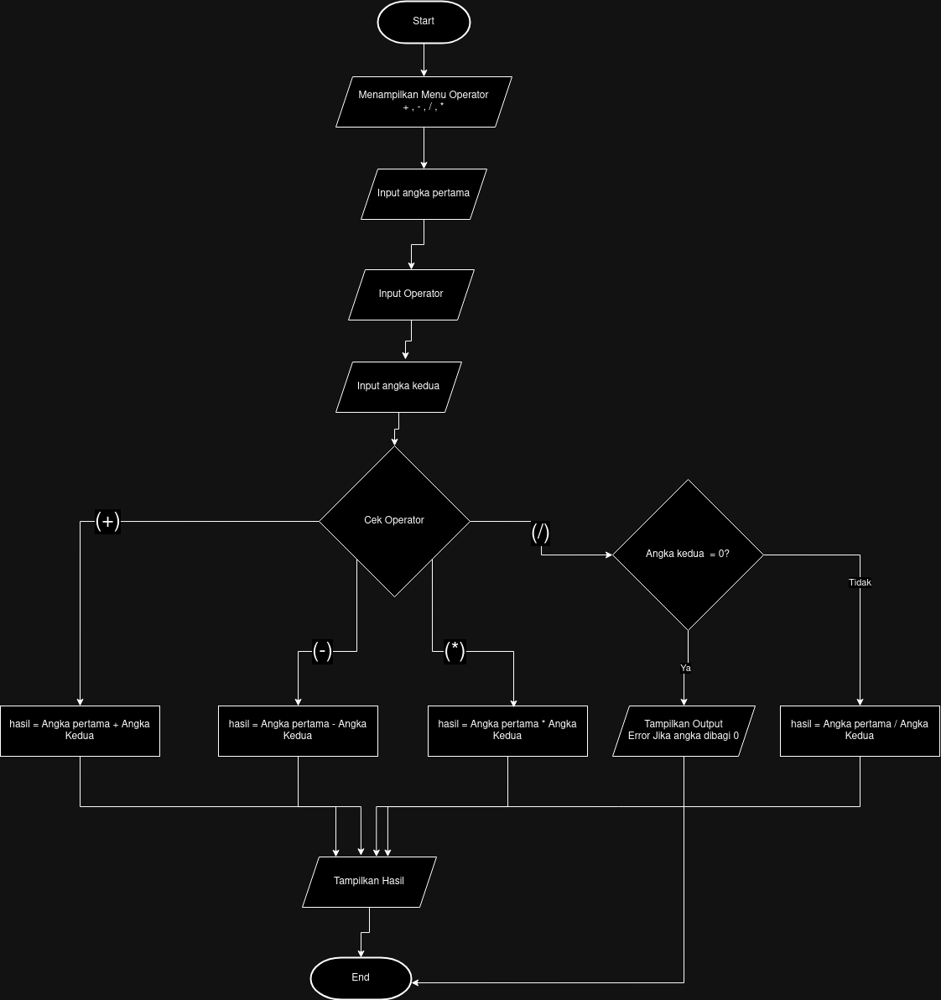
## code
````
# Program Kalkulator Sederhana
print("=== Program Kalkulator Sederhana ===")
print("Operator yang tersedia:")
print("+ : Penjumlahan")
print("- : Pengurangan")
print("* : Perkalian")
print("/ : Pembagian")

try:
    # Input angka pertama
    angka1 = float(input("\nMasukkan angka pertama: "))
    
    # Input operator
    operator = input("Masukkan operator (+, -, *, /): ")
    
    # Input angka kedua
    angka2 = float(input("Masukkan angka kedua: "))
    
    # Proses perhitungan menggunakan if elif else
    if operator == '+':
        hasil = angka1 + angka2
        operasi = "Penjumlahan"
    elif operator == '-':
        hasil = angka1 - angka2
        operasi = "Pengurangan"
    elif operator == '*':
        hasil = angka1 * angka2
        operasi = "Perkalian"
    elif operator == '/':
        if angka2 == 0:
            raise ZeroDivisionError("Pembagian dengan nol tidak diperbolehkan!")
        hasil = angka1 / angka2
        operasi = "Pembagian"
    else:
        raise ValueError("Operator tidak valid!")
    
    # Tampilkan hasil
    print("\n=== Hasil Perhitungan ===")
    print(f"Operasi: {operasi}")
    print(f"{angka1} {operator} {angka2} = {hasil}")

except ValueError as e:
    if str(e) == "Operator tidak valid!":
        print("\nError: Operator yang dimasukkan tidak valid!")
    else:
        print("\nError: Mohon masukkan angka yang valid!")
except ZeroDivisionError as e:
    print(f"\nError: {e}")
except Exception as e:
    print(f"\nTerjadi kesalahan: {e}")
````
## Penjelasan code dari program Kalkulator
````
1.Perintah untuk menampilkan Judul dan Operator yang tersedia
print("=== Program Kalkulator Sederhana ===")
print("Operator yang tersedia:")
print("+ : Penjumlahan")
print("- : Pengurangan")
print("* : Perkalian")
print("/ : Pembagian")
````
2.Mulai blok try untuk menangani Error yang mungkin terjadi
````
try:
````
3.Memulai section untuk input angka dan juga Operasi hitung
````
  # Input angka pertama
    angka1 = float(input("\nMasukkan angka pertama: "))

    # Input operator
    operator = input("Masukkan operator (+, -, *, /): ")

    # Input angka kedua
    angka2 = float(input("Masukkan angka kedua: "))
````
4.Memulai proses perhitungan menggunakan if elif else
````
  if operator == '+':                    # Jika operator adalah +
        hasil = angka1 + angka2           # Lakukan penjumlahan
        operasi = "Penjumlahan"          # Set nama operasi
    elif operator == '-':                 # Jika operator adalah -
        hasil = angka1 - angka2          # Lakukan pengurangan
        operasi = "Pengurangan"          # Set nama operasi
    elif operator == '*':                 # Jika operator adalah *
        hasil = angka1 * angka2          # Lakukan perkalian
        operasi = "Perkalian"            # Set nama operasi
    elif operator == '/':                 # Jika operator adalah /
        if angka2 == 0:                  # Cek jika angka kedua adalah 0
            raise ZeroDivisionError("Pembagian dengan nol tidak diperbolehkan!")  # Raise error jika pembagian dengan 0
        hasil = angka1 / angka2          # Lakukan pembagian
        operasi = "Pembagian"            # Set nama operasi
    else:
        raise ValueError("Operator tidak valid!")  # Raise error jika operator tidak valid
````
5.Menampilkan Hasil
````
    print("\n=== Hasil Perhitungan ===")                   # Menampilkan header hasil
    print(f"Operasi: {operasi}")                          # Menampilkan jenis operasi
    print(f"{angka1} {operator} {angka2} = {hasil}")      # Menampilkan perhitungan dan hasilnya
````
6.Membuat penanganan Error
````
except ValueError as e:                                    # Menangkap error nilai tidak valid
    if str(e) == "Operator tidak valid!":
        print("\nError: Operator yang dimasukkan tidak valid!")
    else:
        print("\nError: Mohon masukkan angka yang valid!")
except ZeroDivisionError as e:                            # Menangkap error pembagian dengan nol
    print(f"\nError: {e}")
except Exception as e:                                     # Menangkap error lainnya
    print(f"\nTerjadi kesalahan: {e}")
````
## output
#### Program akan meminta input angka dan Operator perhitungan
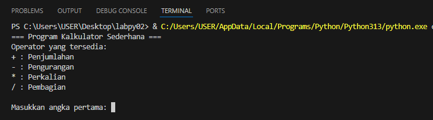
#### Contoh apabila kita memilih Operasi hitung Penjumlahan
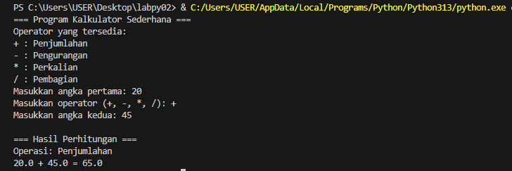
#### Contoh apabila kita memilih Operasi hitung Pengurangan
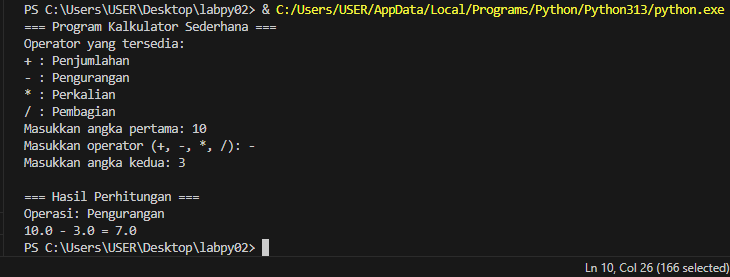
#### Contoh apabila kita memilih Operasi hitung Perkalian
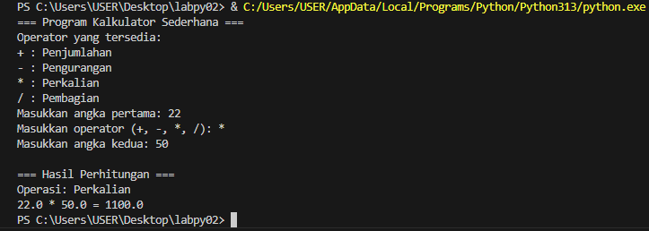
#### Contoh apabila kita memilih Operasi hitung Pembagian
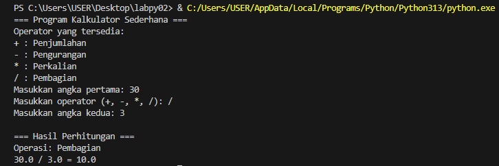
#### Contoh apabila kita memilih Operasi hitung Pembagian namun dibagi 0
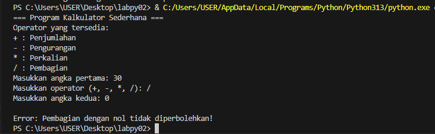

Apabila angka kedua adalah 0 maka pembagian akan error.

